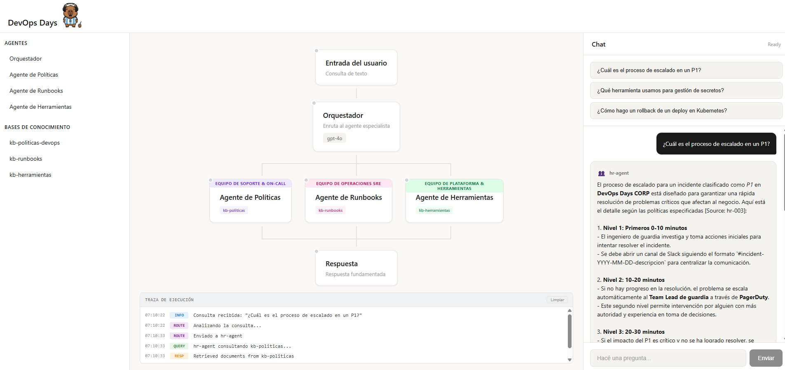
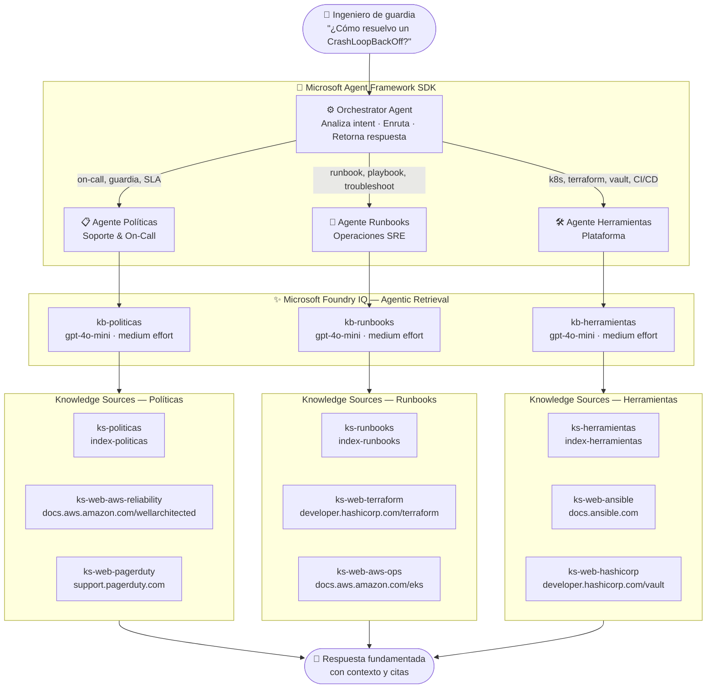
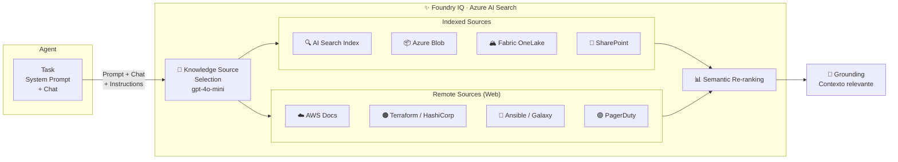

```
██████╗ ███████╗██╗   ██╗ ██████╗ ██████╗ ███████╗    ██████╗  █████╗ ██╗   ██╗███████╗
██╔══██╗██╔════╝██║   ██║██╔═══██╗██╔══██╗██╔════╝    ██╔══██╗██╔══██╗╚██╗ ██╔╝██╔════╝
██║  ██║█████╗  ██║   ██║██║   ██║██████╔╝███████╗    ██║  ██║███████║ ╚████╔╝ ███████╗
██║  ██║██╔══╝  ╚██╗ ██╔╝██║   ██║██╔═══╝ ╚════██║    ██║  ██║██╔══██║  ╚██╔╝  ╚════██║
██████╔╝███████╗ ╚████╔╝ ╚██████╔╝██║     ███████║    ██████╔╝██║  ██║   ██║   ███████║
╚═════╝ ╚══════╝  ╚═══╝   ╚═════╝ ╚═╝     ╚══════╝    ╚═════╝ ╚═╝  ╚═╝   ╚═╝   ╚══════╝
```

Demo de orquestación multi-agente usando Microsoft Agent Framework SDK y Azure AI Foundry con FoundryIQ Knowledge Bases para Agentic Retrieval. Simula un asistente interno que un ingeniero de guardia puede consultar para resolver incidentes.



## Features

- **Multi-Agent Orchestration**: Enrutamiento inteligente hacia agentes especializados (Políticas, Runbooks, Herramientas)
- **Microsoft Agent Framework SDK**: Construido sobre el SDK oficial `agent-framework` de Python
- **FoundryIQ Knowledge Bases**: Modo Agentic Retrieval con `gpt-4o-mini` para respuestas fundamentadas
- **RBAC-Only Authentication**: Sin API keys — usa `DefaultAzureCredential` en todos los servicios
- **Fully Automated Deployment**: Infrastructure as Code con Bicep + setup scripts

## Architecture

### Flujo de una consulta



### Cómo funciona Foundry IQ



## Prerequisites

- Azure subscription con Owner o Contributor + User Access Administrator
- [Azure CLI](https://learn.microsoft.com/cli/azure/install-azure-cli)
- [Azure Developer CLI (azd)](https://learn.microsoft.com/azure/developer/azure-developer-cli/install-azd)
- [Python 3.11+](https://www.python.org/downloads/)
- [Node.js 18+](https://nodejs.org/) (para el frontend)

## Quick Start

### 1. Clonar y configurar

```bash
git clone https://github.com/Martin-Sciarrillo/Demo-DevOps-Days.git
cd Demo-DevOps-Days

# Crear virtual environment
python -m venv .venv

# Windows
.venv\Scripts\Activate.ps1
# Linux/Mac
source .venv/bin/activate

# Instalar dependencias
pip install -r requirements-dev.txt
```

### 2. Deploy Infrastructure

```bash
az login && azd auth login
azd up
```

### 3. Setup índices y datos

```bash
./scripts/setup_indexes.sh
./scripts/upload_sample_data.sh
```

### 4. Crear FoundryIQ Knowledge Sources y Knowledge Bases

```bash
python scripts/setup_foundry_devops.py
```

Esto crea en Azure AI Search (via Foundry IQ):
- **Knowledge Sources**: `ks-politicas`, `ks-runbooks`, `ks-herramientas`
- **Knowledge Bases**: `kb-politicas`, `kb-runbooks`, `kb-herramientas`

Verificación: [ai.azure.com](https://ai.azure.com) → proyecto `devopsdays` → **Knowledge** → Knowledge bases

### 5. Configurar variables de entorno

Crear `.env` en la raíz del repo:

```env
AZURE_OPENAI_ENDPOINT=https://<your-resource>.openai.azure.com/
AZURE_SEARCH_ENDPOINT=https://<your-resource>.search.windows.net
AZURE_OPENAI_DEPLOYMENT=gpt-4o-mini
AZURE_AI_PROJECT_ENDPOINT=https://<your-foundry>.services.ai.azure.com/api/projects/<project>
```

### 6. Levantar la app

```bash
# Backend
cd app/backend
uvicorn main:app --port 8000

# Frontend (dev mode, en otra terminal)
cd app/frontend
npm install
npm run dev  # → http://localhost:5173
```

O en modo full (frontend buildeado dentro del backend):
```bash
cd app/frontend && npm run build
# Todo en http://localhost:8000
```

### 7. Probar el orquestador en CLI

```bash
python app/backend/agents/orchestrator.py
```

Probá: `"¿Cuál es el proceso de postmortem blameless?"` o `"¿Cómo accedo a Vault para gestionar secretos?"`

## Project Structure

```
├── app/
│   ├── backend/
│   │   ├── main.py              # FastAPI app (inicializa agentes al startup)
│   │   └── agents/
│   │       ├── orchestrator.py      # Router + agentes especialistas + singleton state
│   │       ├── config.py            # Endpoints, índices y KB names
│   │       ├── politicas_agent.py   # Standalone — agente de políticas & on-call
│   │       ├── runbooks_agent.py    # Standalone — agente de runbooks operacionales
│   │       └── herramientas_agent.py # Standalone — agente de herramientas internas
│   └── frontend/
│       └── src/
│           ├── App.tsx          # UI React con workflow canvas + chat
│           └── index.css        # Estilos
├── infra/                       # Bicep IaC templates
├── scripts/
│   ├── setup_foundry_devops.py  # Crea KBs y KSs en Foundry IQ (RBAC)
│   ├── setup_indexes.sh         # Crea índices en Azure AI Search
│   ├── upload_sample_data.sh    # Sube datos de ejemplo
│   └── setup_rbac.sh            # Asigna roles RBAC necesarios
└── docs/                        # Documentación y screenshots
```

## Knowledge Base Mapping

| Agente | Knowledge Base | Knowledge Sources | Contenido |
|--------|---------------|-------------------|-----------|
| Políticas | `kb-politicas` | `ks-politicas` (internal) · `ks-web-aws-reliability` (AWS Well-Architected) · `ks-web-pagerduty` (PagerDuty) | On-call, SLA/SLO, postmortem, escalation policies |
| Runbooks | `kb-runbooks` | `ks-runbooks` (internal) · `ks-web-terraform` (HashiCorp) · `ks-web-aws-ops` (AWS EKS/SSM) | Runbooks, playbooks P1/P2, IaC procedures |
| Herramientas | `kb-herramientas` | `ks-herramientas` (internal) · `ks-web-ansible` (Ansible/Galaxy) · `ks-web-hashicorp` (Vault/Consul) | Kubernetes, Terraform, Vault, CI/CD, Ansible |

## Troubleshooting

| Issue | Fix |
|-------|-----|
| `403 Forbidden` | Portal → Search → Keys → "Both" (API keys + RBAC) |
| `ModuleNotFoundError: config` | Correr uvicorn desde `app/backend/`, no desde la raíz |
| `ModuleNotFoundError: dotenv` | Activar venv primero: `.venv\Scripts\Activate.ps1` |
| KBs no aparecen en Foundry | Conectar el recurso AI Search en ai.azure.com → Knowledge → seleccionar `srch-*` con Microsoft Entra ID |
| Respuestas genéricas | Verificar que los índices tienen documentos (`upload_sample_data.sh`) |
| Primera respuesta lenta | Normal — warmup de token Azure AD. Las siguientes son más rápidas. |
| Múltiples instancias en puerto 8000 | `taskkill /F /IM python.exe /T` y volver a levantar |

## License

MIT License

---

## Referencias

- 🤖 [More about Agent Framework](https://aka.ms/agent-framework)
- 🔍 [More about Foundry IQ](https://aka.ms/FoundryIQ)
- 👤 [More about me](https://aka.ms/Tincho)
